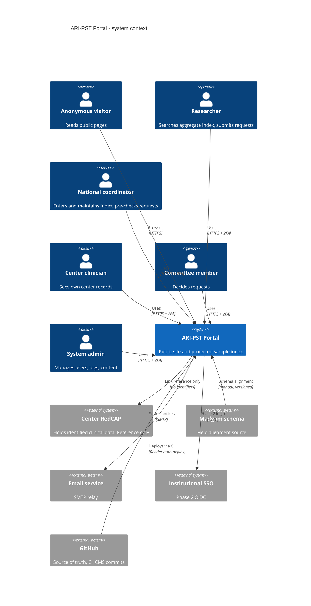
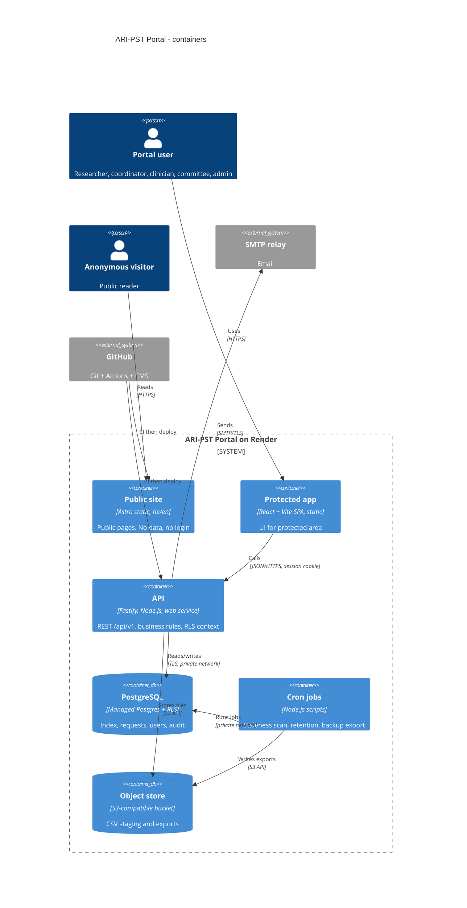
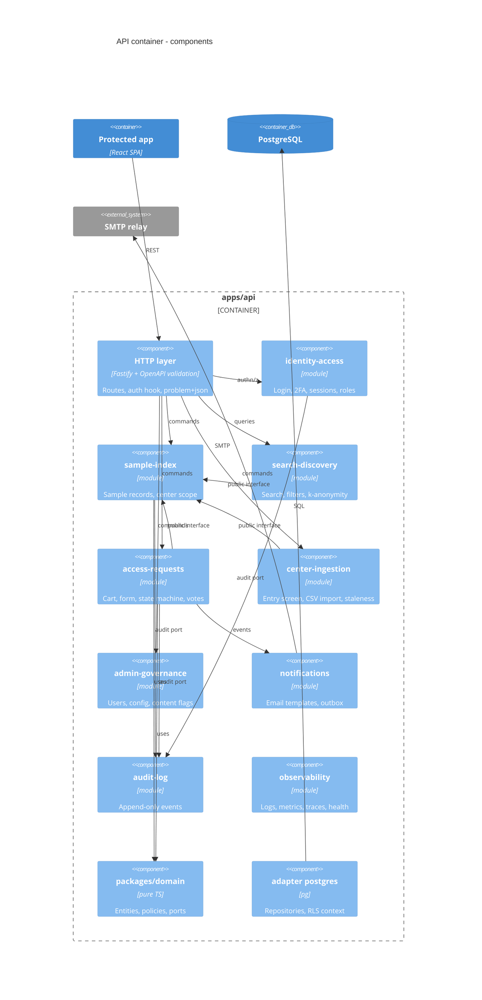

# 02 — C4 diagrams

All data in these diagrams is synthetic. Valid Mermaid (C4 syntax).

## Level 1 — System context

```mermaid
C4Context
  title ARI-PST Portal - system context
  Person(visitor, "Anonymous visitor", "Reads public pages")
  Person(researcher, "Researcher", "Searches aggregate index, submits requests")
  Person(coordinator, "National coordinator", "Enters and maintains index, pre-checks requests")
  Person(clinician, "Center clinician", "Sees own center records")
  Person(committee, "Committee member", "Decides requests")
  Person(admin, "System admin", "Manages users, logs, content")
  System(portal, "ARI-PST Portal", "Public site and protected sample index")
  System_Ext(redcap, "Center RedCAP", "Holds identified clinical data. Reference only")
  System_Ext(madgam, "Madgam schema", "Field alignment source")
  System_Ext(mail, "Email service", "SMTP relay")
  System_Ext(sso, "Institutional SSO", "Phase 2 OIDC")
  System_Ext(github, "GitHub", "Source of truth, CI, CMS commits")
  Rel(visitor, portal, "Browses", "HTTPS")
  Rel(researcher, portal, "Uses", "HTTPS + 2FA")
  Rel(coordinator, portal, "Uses", "HTTPS + 2FA")
  Rel(clinician, portal, "Uses", "HTTPS + 2FA")
  Rel(committee, portal, "Uses", "HTTPS + 2FA")
  Rel(admin, portal, "Uses", "HTTPS + 2FA")
  Rel(portal, mail, "Sends notices", "SMTP")
  Rel(portal, sso, "Phase 2 login", "OIDC")
  Rel(portal, redcap, "Link reference only", "no identifiers")
  Rel(github, portal, "Deploys via CI", "Render auto-deploy")
  Rel(madgam, portal, "Schema alignment", "manual, versioned")
```

## Level 2 — Containers

```mermaid
C4Container
  title ARI-PST Portal - containers
  Person(user, "Portal user", "Researcher, coordinator, clinician, committee, admin")
  Person(visitor, "Anonymous visitor", "Public reader")
  System_Boundary(portal, "ARI-PST Portal on Render") {
    Container(site, "Public site", "Astro static, he/en", "Public pages. No data, no login")
    Container(spa, "Protected app", "React + Vite SPA, static", "UI for protected area")
    Container(api, "API", "Fastify, Node.js, web service", "REST /api/v1, business rules, RLS context")
    ContainerDb(db, "PostgreSQL", "Managed Postgres + RLS", "Index, requests, users, audit")
    Container(cron, "Cron jobs", "Node.js scripts", "Staleness scan, retention, backup export")
    ContainerDb(obj, "Object store", "S3-compatible bucket", "CSV staging and exports")
  }
  System_Ext(mail, "SMTP relay", "Email")
  System_Ext(github, "GitHub", "Git + Actions + CMS")
  Rel(visitor, site, "Reads", "HTTPS")
  Rel(user, spa, "Uses", "HTTPS")
  Rel(spa, api, "Calls", "JSON/HTTPS, session cookie")
  Rel(api, db, "Reads/writes", "TLS, private network")
  Rel(api, obj, "Stores files", "S3 API")
  Rel(api, mail, "Sends", "SMTP/TLS")
  Rel(cron, db, "Runs jobs", "private network")
  Rel(cron, obj, "Writes exports", "S3 API")
  Rel(github, site, "CI then deploy", "")
  Rel(github, api, "CI then deploy", "")
```

## Level 3 — Components of the API container

```mermaid
C4Component
  title API container - components
  Container(spa, "Protected app", "React SPA", "")
  ContainerDb(db, "PostgreSQL", "", "")
  System_Ext(mail, "SMTP relay", "")
  Container_Boundary(api, "apps/api") {
    Component(http, "HTTP layer", "Fastify + OpenAPI validation", "Routes, auth hook, problem+json")
    Component(ida, "identity-access", "module", "Login, 2FA, sessions, roles")
    Component(idx, "sample-index", "module", "Sample records, center scope")
    Component(srch, "search-discovery", "module", "Search, filters, k-anonymity")
    Component(req, "access-requests", "module", "Cart, form, state machine, votes")
    Component(ing, "center-ingestion", "module", "Entry screen, CSV import, staleness")
    Component(adm, "admin-governance", "module", "Users, config, content flags")
    Component(ntf, "notifications", "module", "Email templates, outbox")
    Component(aud, "audit-log", "module", "Append-only events")
    Component(obs, "observability", "module", "Logs, metrics, traces, health")
    Component(dom, "packages/domain", "pure TS", "Entities, policies, ports")
    Component(pgad, "adapter postgres", "pg", "Repositories, RLS context")
  }
  Rel(spa, http, "REST")
  Rel(http, ida, "authn/z")
  Rel(http, srch, "queries")
  Rel(http, idx, "commands")
  Rel(http, req, "commands")
  Rel(http, ing, "commands")
  Rel(http, adm, "commands")
  Rel(srch, idx, "public interface")
  Rel(req, idx, "public interface")
  Rel(ing, idx, "public interface")
  Rel(req, ntf, "events")
  Rel(idx, aud, "audit port")
  Rel(req, aud, "audit port")
  Rel(ida, aud, "audit port")
  Rel(idx, dom, "uses")
  Rel(req, dom, "uses")
  Rel(pgad, db, "SQL")
  Rel(ntf, mail, "SMTP")
```
